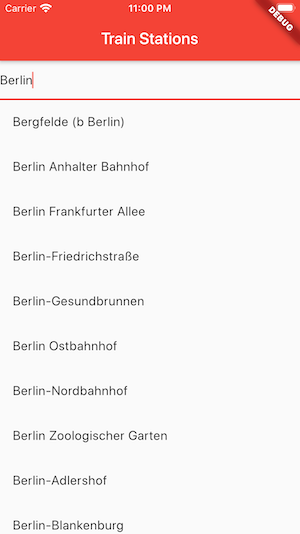

# dbstadafasta

Deutsche Bahn Train Station Facilities

## A cross-platform flutter app for displaying actual train station facilities in Germany.

  
  
  

This app is using 2 APIs from Deutsche Bahn -
[list](https://developer.deutschebahn.com/store/apis/list) - StaDa and FaSta.

In order to use the app, please copy access token from
[your dev account](https://developer.deutschebahn.com/store/site/pages/subscriptions.jag)

and paste it to a copy of `main.dart` file, for example, `main_my.dart`.

To run the project from console, please specify your custom entry point,
for example `flutter run -t lib/main_my.dart`.
